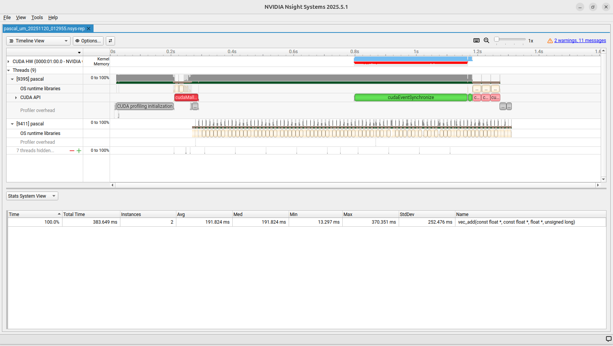

# Pascal Unified Memory Performance Analysis

A small, reproducible follow-up to the original Stack Overflow report of severe Unified Memory slowdown on Pascal GPUs. 

**“Why is NVIDIA Pascal GPUs slow on running CUDA kernels when using cudaMallocManaged?”**

This project extends a 9-year-old discussion with a focused benchmark, working example code, and profiler-backed evidence showing how demand-paged `cudaMallocManaged` falls into a PCIe-limited regime and how `cudaMemPrefetchAsync` restores DRAM-limited bandwidth.

**Reference:** [StackOverflow Question - Pascal Unified Memory Slowdown](https://stackoverflow.com/questions/39782746)


## Results

**Measured on GTX 1080:**
```
Naive UM:    8.2 GB/s  (386.6 ms, 31,774 page faults)
Prefetch UM: 242.3 GB/s (13.3 ms, zero page faults)
Speedup:     29.5x
```

**Hardware:**
- GPU: NVIDIA GeForce GTX 1080 (SM 6.1)
- VRAM: 8 GB GDDR5X
- CUDA Cores: 2560
- Memory Clock: 5005 MHz
- Theoretical Peak: 320 GB/s
- Achieved: 242 GB/s (75% efficiency)

## Solution

```cuda
cudaMemPrefetchAsync(data, size, deviceId, stream);
```

Eliminates page-fault-driven migration by transferring data to GPU before kernel execution.

---

## Quick Start (Experts)

**Prerequisites:** CUDA Toolkit 12.0-12.6, matching NVIDIA Driver, Python 3.8+

```bash
git clone https://github.com/parallelArchitect/pascal-um-benchmark
cd pascal-um-benchmark
pip install reportlab pycuda
make
python3 pascal_analyzer.py --pdf
```

**New to CUDA?** See Full Installation

---

## Installation

### Why CUDA 12.x?

Pascal GPUs (SM 6.0-6.2) supported through CUDA 12.6, dropped in CUDA 13.0+.

**Tested with CUDA 12.0, works with 12.0-12.6**

**Key requirement:** nvprof profiler (removed in CUDA 13.0+)

### Step 1: Install NVIDIA Driver

```bash
sudo apt update
sudo apt install nvidia-driver-535
sudo reboot
```

**Verify:**
```bash
nvidia-smi
```

**Should show your GPU:**
```
GPU 0: NVIDIA GeForce GTX 1080
Driver Version: 535.x
```

### Step 2: Install CUDA Toolkit

**Download:** [CUDA Toolkit Downloads](https://developer.nvidia.com/cuda-downloads)

Select CUDA 12.0-12.6 for your OS. The installer will guide you through setup.

**After installation, add to PATH:**

First check if already configured:
```bash
nvcc --version
```

If command not found, add to PATH:
```bash
echo 'export PATH=/usr/local/cuda/bin:$PATH' >> ~/.bashrc
echo 'export LD_LIBRARY_PATH=/usr/local/cuda/lib64:$LD_LIBRARY_PATH' >> ~/.bashrc
source ~/.bashrc
```

**Verify installation:**
```bash
nvcc --version  # Should show: release 12.x
nvprof --version  # Should show: Release 12.x
```

### Step 3: Install Python Dependencies

```bash
pip install reportlab pycuda
```

**If you get an error about "externally-managed-environment":**
```bash
pip install reportlab pycuda --break-system-packages
```

### Step 4: Clone and Build

```bash
git clone https://github.com/parallelArchitect/pascal-um-benchmark
cd pascal-um-benchmark
make
```

**Compilation output:**
```
nvcc pascal.cu -o pascal -arch=sm_61
```

### Step 5: Verify Installation

```bash
python3 pascal_analyzer.py --diagnose
```

**Example output (GTX 1080):**
```
Pascal Unified Memory Profiler — Diagnostics
===========================================
PyCUDA available:   True
reportlab available: True
=== GPU DIAGNOSTICS ===
Detection path:     PyCUDA driver API
GPU:                NVIDIA GeForce GTX 1080
Compute capability: 6.1
SM count:           20
CUDA cores:         2560
VRAM (MB):          8192
=======================
```

**Note:** Your output will show your GPU's specifications (different models have different core counts, VRAM, SM counts).

**If you see errors:**
- `PyCUDA available: False` → Run `pip install pycuda --break-system-packages`
- `reportlab available: False` → Run `pip install reportlab`
- `GPU: Unknown` → Check driver:
  ```bash
  nvidia-smi  # Should show your GPU
  # If not found, reinstall NVIDIA driver:
  sudo apt install nvidia-driver-535
  sudo reboot
  
  # Verify after reboot
  nvidia-smi
  python3 pascal_analyzer.py --diagnose
  ```

---

## Usage

### Generate PDF Report

```bash
python3 pascal_analyzer.py --pdf
```

**Output:** `results/pascal_analysis/pascal_um_1G_TIMESTAMP.pdf`

Includes: Hardware specs, kernel timing, page fault analysis, bandwidth measurements


### JSON Export

```bash
python3 pascal_analyzer.py --json
```

**Output:** Terminal only (no file saved)

Structured data for automation, CI/CD integration, or custom analysis scripts.

**Example output:**
```json
{
  "timestamp": "2025-11-19 02:58:07",
  "gpu": {
    "model": "NVIDIA GeForce GTX 1080",
    "compute_cap": "6.1",
    "cuda_cores": 2560
  },
  "kernels": {
    "prefetch_ms": 13.3,
    "naive_ms": 363.9,
    "speedup": 26.0
  },
  "bandwidth": {
    "naive_gbps": 9.3,
    "prefetch_gbps": 241.5
  }
}
```

### Raw nvprof Output

```bash
python3 pascal_analyzer.py --nvprof
```

**Output:** Terminal only (no file saved)

Page fault counts, transfer statistics, detailed profiler metrics.

### Nsight Systems Timeline

```bash
python3 pascal_analyzer.py --nsys
nsys-ui results/nsight/*.nsys-rep
```

**Output:**
- `results/nsight/pascal_um_1G_TIMESTAMP.nsys-rep` (timeline visualization)
- `results/nsight/pascal_um_1G_TIMESTAMP.sqlite` (queryable database)

**Note:** Only `--pdf` and `--nsys` generate output files. `--json` and `--nvprof` print to terminal only.

---

## Output Modes

**Quick Report:**
- `--pdf` → Professional report (hardware, timing, page faults, bandwidth)
- `--json` → Machine-readable metrics (automation, CI/CD)

**Raw Profiling:**
- `--nvprof` → Terminal output (page fault counts, bandwidth, transfer statistics)
- `--nsys` → Timeline visualization + SQLite database (individual operations, API timing)

**Use `--nsys` for:** Deep analysis, individual transfer sizes, CUDA API timing, queryable data

**Use `--pdf` for:** Sharing results, documentation, reports

---

## Nsight Systems Profiling

### Basic Timeline

```bash
python3 pascal_analyzer.py --nsys
nsys-ui results/nsight/*.nsys-rep
```

### Advanced Profiling

For detailed statistics and API traces:

```bash
CUDA_LAUNCH_BLOCKING=1 CUDA_DEVICE_MAX_CONNECTIONS=8 \
nsys profile \
  --trace=cuda,osrt \
  --sample=none \
  --stats=true \
  --force-overwrite=true \
  --cuda-event-trace=false \
  -o results/nsight/trace \
  ./pascal --mb 2048
```

**Generated files:**
- `trace.nsys-rep` - Timeline (open with nsys-ui)
- `trace.sqlite` - Database (for automation)

**Reports included:**
- OS Runtime Summary (`osrt_sum`)
- CUDA API Summary (`cuda_api_sum`)
- GPU Kernel Summary (`cuda_gpu_kern_sum`)
- Memory Transfer Summary (`cuda_gpu_mem_time_sum`)
- Memory Size Summary (`cuda_gpu_mem_size_sum`)

### Timeline View



Visual proof: Page fault activity during naive kernel vs clean prefetch execution.

### SQLite Query Examples

**Kernel execution times (ms):**
```bash
sqlite3 results/nsight/trace.sqlite \
  "SELECT (end-start)/1000000.0 as duration_ms 
   FROM CUPTI_ACTIVITY_KIND_KERNEL 
   ORDER BY duration_ms DESC;"
```
**Output:** `382.6` (naive), `13.3` (prefetch)

**Memory transfer statistics:**
```bash
sqlite3 results/nsight/trace.sqlite \
  "SELECT COUNT(*) as transfers, 
          SUM(bytes)/1024/1024 as total_mb,
          AVG(bytes)/1024 as avg_kb
   FROM CUPTI_ACTIVITY_KIND_MEMCPY;"
```
**Output:** `30078 transfers | 2147 MB | 71 KB average`

**Slowest CUDA API calls:**
```bash
sqlite3 results/nsight/trace.sqlite \
  "SELECT (end-start)/1000000.0 as duration_ms 
   FROM CUPTI_ACTIVITY_KIND_RUNTIME 
   ORDER BY duration_ms DESC LIMIT 5;"
```
**Output:** `382.8`, `116.2`, `30.7` (cudaLaunchKernel, cudaMallocManaged, cudaFree)

---

## Technical Background

Pascal GPUs use page-fault-driven unified memory migration:

**Without prefetch:**
1. CPU initializes data in system memory
2. Kernel launch triggers GPU access
3. Each memory access generates page fault
4. Runtime migrates 4KB-1MB pages over PCIe
5. Kernel execution blocks during migration

**Result:** 30x slower than theoretical bandwidth (8.2 GB/s vs 242 GB/s)

**With `cudaMemPrefetchAsync`:**
1. Explicit bulk transfer before kernel execution
2. Data resident in GPU memory at kernel launch
3. No page faults during execution
4. Full memory bandwidth achieved

**Architecture details:**
- Page size: 4KB-1MB (adaptive)
- Transfer overhead: ~71 KB average per fault
- Migration time: ~189 ms for 2 GB (30,078 transfers)
- PCIe bandwidth utilized: ~10 GB/s during migration

---

## Tested Environment

- **GPU:** NVIDIA GeForce GTX 1080 (8 GB GDDR5X, SM 6.1)
- **Driver:** 535.274.02
- **CUDA Toolkit:** 12.0
- **Compiler:** nvcc 12.0 (V12.0.140)
- **Nsight Systems:** 2025.5.1
- **Python:** 3.10
- **OS:** Ubuntu 24.04 LTS
- **Dependencies:** reportlab, pycuda

---

## Compatibility

**CUDA:** 12.0-12.6 (nvprof available), 13.0+ (nvprof removed) 
**OS:** Linux (Ubuntu, RHEL, Debian) 
**Windows:** Use [WSL2](https://learn.microsoft.com/en-us/windows/wsl/about) with Ubuntu 
**GPU:** Pascal SM 6.1 (GTX 1050-1080 Ti, Titan X/Xp, Tesla P40/P4) 
**Note:** Tesla P100 (SM 6.0) has different UM implementation, may show smaller speedup

---

## References

**Key Insight:**
- Robert Crovella's [StackOverflow Answer](https://stackoverflow.com/questions/39782746) - Identified `cudaMemPrefetchAsync` as solution to Pascal UM bottleneck

**Documentation:**
1. [NVIDIA: Beyond GPU Memory Limits](https://developer.nvidia.com/blog/beyond-gpu-memory-limits-unified-memory-pascal/) - Pascal UM architecture
2. [NVIDIA: Unified Memory for CUDA Beginners](https://developer.nvidia.com/blog/unified-memory-cuda-beginners/) - Programming guide
3. [NVIDIA: Pascal Tuning Guide](https://docs.nvidia.com/cuda/pascal-tuning-guide/) - Architecture documentation
4. [NVIDIA: CUDA Profiler User's Guide](https://docs.nvidia.com/cuda/profiler-users-guide/) - nvprof and Nsight Systems

---

## License

MIT License

Copyright (c) 2025 Joe McLaren

Permission is hereby granted, free of charge, to any person obtaining a copy
of this software and associated documentation files (the "Software"), to deal
in the Software without restriction, including without limitation the rights
to use, copy, modify, merge, publish, distribute, sublicense, and/or sell
copies of the Software, and to permit persons to whom the Software is
furnished to do so, subject to the following conditions:

The above copyright notice and this permission notice shall be included in all
copies or substantial portions of the Software.

THE SOFTWARE IS PROVIDED "AS IS", WITHOUT WARRANTY OF ANY KIND, EXPRESS OR
IMPLIED, INCLUDING BUT NOT LIMITED TO THE WARRANTIES OF MERCHANTABILITY,
FITNESS FOR A PARTICULAR PURPOSE AND NONINFRINGEMENT. IN NO EVENT SHALL THE
AUTHORS OR COPYRIGHT HOLDERS BE LIABLE FOR ANY CLAIM, DAMAGES OR OTHER
LIABILITY, WHETHER IN AN ACTION OF CONTRACT, TORT OR OTHERWISE, ARISING FROM,
OUT OF OR IN CONNECTION WITH THE SOFTWARE OR THE USE OR OTHER DEALINGS IN THE
SOFTWARE.

---

## Author

**Joe McLaren** - Human-AI Collaborative Engineering

This project demonstrates measured analysis of Pascal GPU unified memory performance characteristics. Built with systematic profiling methodology and live hardware data collection.

**Bug reports and technical questions:** [GitHub Issues](https://github.com/parallelArchitect/pascal-um-benchmark/issues)
